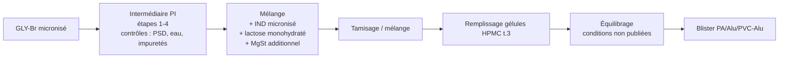
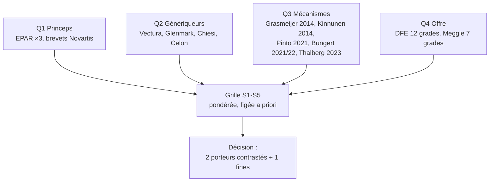
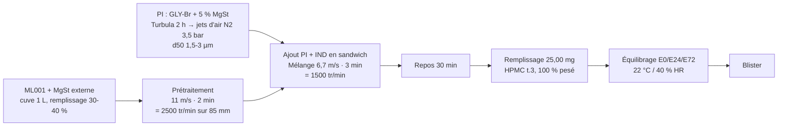
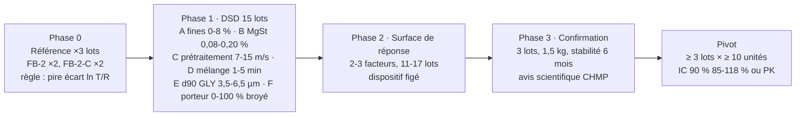

# Script de présentation — Générique d'Ultibro Breezhaler : état des connaissances, candidat et plan

16 diapositives · ~20 min · statuts : **[E]** établi (source publique lue) · **[C]** calculé (scripts du projet) · **[H]** hypothèse.

---

## 1. Titre
**Titre** : Générique indacatérol 110 µg / glycopyrronium 50 µg — ce que nous savons, ce que nous proposons, ce que nous demandons
**Texte** : Dossier de préformulation et plan de développement · Version 1.0 · 11/09/2026
**Visuel** : trois blocs « Connu → Identifié → Proposé » reliés par des flèches.
**Notes** : Aucun lot fabriqué. Tout ce qui suit est documentaire et calculé ; chaque chiffre est reproductible par les scripts du dossier.

---

## 2. Le produit de référence en une diapositive
**Titre** : Ultibro est un mélange adhésif lactose + MgSt en gélule HPMC, avec un intermédiaire de glycopyrronium
**Tableau** [E] :
| Élément | Valeur | Source |
|---|---|---|
| Contenu / gélule | 143 µg maléate d'IND (110 µg base) ; 63 µg bromure de GLY (50 µg base) | RCP |
| Dose délivrée | 85 / 43 µg | RCP |
| Excipients | Lactose monohydraté (« 23,5 mg »), stéarate de magnésium | RCP |
| Gélule / blister | HPMC taille 3 ; PA/Alu/PVC-Alu | RCP, EPAR |
| Procédé | 13 étapes ; 4 premières = intermédiaire pharmaceutique (PI) de GLY ; puis IND + lactose + **MgSt additionnel** ; remplissage ; **équilibrage** ; blister | EPAR 2013 p. 13-14 |
| Sensibilités | Produit sensible à l'humidité (FPM) ; FPF d'IND **plus élevée** en association qu'en monothérapie → dose IND réduite 150 → 110 µg | EPAR 2013 |
**Visuel** : le tableau + pastilles [E].
**Notes** : L'EPAR ne donne ni grade de lactose, ni PSD, ni conditions d'équilibrage. Le PI de GLY est très probablement un co-broyage GLY + MgSt (brevet Novartis, diapo 4).

---

## 3. Flowchart du procédé princeps tel que documenté
**Titre** : Le procédé public tient en cinq blocs ; les paramètres sont confidentiels
**Visuel** (Mermaid) :

**Notes** : Ordre « PI puis blending, sieving, adding remaining components » cité textuellement. Tout ce qui est en gris dans notre plan est reconstruit.

---

## 4. Ce que les brevets et l'article de référence ajoutent
**Titre** : Trois sources publiques fixent le cadre : brevet du PI, étude Celon 2025, guide EMA 2026
**Tableau** :
| Source | Apport | Statut |
|---|---|---|
| Novartis EP2037879 / US10314784 | Co-micronisation GLY + 3-5 % MgSt réduit l'agglomération, conserve la FPF au stockage ; EP **révoqué**, US active (2028) ; ratio porteur/PI revendiqué 200:1-20:1 (Ultibro ≈ 377:1) | [E] |
| Rzewińska et al., AAPS PharmSciTech 2025 (Celon) | 70 mélanges à 0,14 % MgSt, 300 g / GEA 1 L, 2500 tr/min 2 min puis actifs 1500 tr/min 3 min ; **d10 du lactose** = variable dominante pour IND ; GLY gouverné par sa PSD et l'énergie de mélange | [E] |
| EMA CPMP/EWP/4151/00 Rev. 2 (en vigueur 01/02/2026) | Équivalence in vitro : IC 90 % du rapport T/R dans 85-118 % par étage/groupe, par actif, 3 débits ; ≥ 3 lots × 10 unités | [E] |
| PAR suédois Polpharma (06/2025) | Premier générique approuvé : voie hybride avec **deux études PK** (l'in vitro seul n'a pas suffi) | [E] |
**Visuel** : capture de la première page de Rzewińska 2025 (DOI 10.1208/s12249-025-03182-9) + carte de citation du guide EMA.
**Notes** : Le précédent Polpharma calibre le risque : prévoir le budget PK.

---

## 5. Ce que nous avons calculé et qui tient
**Titre** : Quatre résultats chiffrés structurent le projet
**Texte** [C] :
1. **Remplissage** : le croisement des RCP Onbrez/Seebri/Ultibro donne deux scénarios cohérents, 25,0 mg (lactose déclaré en anhydre) ou 23,75 mg — tranché par la pesée de 30 gélules.
2. **Surface** : les fines (IND + GLY + MgSt) couvrent ≈ 3 % de la surface du porteur ; ≈ 180 particules d'IND et 80 de GLY par grain de lactose → compétition pour les sites actifs, mécanisme plausible de la FPF d'IND accrue.
3. **Mélange** : CV aléatoire 0,03 % pour des primaires de 2 µm mais 7 % pour des agglomérats de 100 µm → l'homogénéité est un problème de désagglomération.
4. **Statistique** : avec 8 % de CV inter-lot, 3 lots × 10 unités n'ont que 34 % de chances de passer le critère EMA même pour un produit identique ; 6 × 10 → 85 %. Cible de développement : T/R = 1,00 ± 0,05.
**Visuel** : quatre cartes avec le chiffre clé en grand ; petit graphique en barres de la puissance (3×10 / 3×20 / 5×10 / 6×10 à CV 8 %).
**Notes** : Scripts `tools/formulation.py`, `tools/equivalence_power.py`. Hypothèses de PSD/densité marquées dans le JSON de sortie.

---

## 6. Ce qui gouverne la performance : analyse de risque
**Titre** : Deux actifs, deux leviers différents — le porteur pour IND, le PI et le cisaillement pour GLY
**Tableau** (extrait de la matrice CMA/CPP → CQA) :
| Levier | APSD IND | APSD GLY | Stabilité | Preuve |
|---|---|---|---|---|
| d10 / fines du lactose | **Haut** | Moyen | Moyen | Rzewińska 2025 ; Kinnunen 2014 |
| PSD du GLY (d90) | Faible | **Haut** | Haut | Rzewińska 2025 ; brevet Novartis |
| MgSt : quantité et localisation (PI vs externe) | Haut | **Haut** | **Haut** | EPAR ; brevet ; Bungert 2021 |
| Énergie de prétraitement (étalement du MgSt) | Haut | Haut | Moyen | Thalberg 2023 ; Bungert 2021 |
| Énergie du mélange final | Moyen | Moyen | Faible | § 4.2 (désagglomération) |
| Humidité fabrication / équilibrage | Moyen | Moyen | **Haut** | EPAR |
**Visuel** : le tableau en heat-map (3 niveaux).
**Notes** : Interdiction de raisonner sur une FPF globale : la dose délivrée de référence retient 23 % d'IND et 14 % de GLY (85/110 et 43/50).

---

## 7. Sélection des lactoses : méthode
**Titre** : Nous avons choisi les lactoses par une grille fixée avant la recherche, sur brevets, littérature primaire et fiches fournisseurs
**Visuel** (Mermaid) :

**Texte** : Critères : compatibilité princeps ×2, fines intrinsèques ×2, aptitude au dry-coating MgSt, contraste utile pour le plan, disponibilité.
**Notes** : Les EPAR ne citent qu'un lactose et aucune fine ajoutée ; les 6 % de fines « a priori » n'ont aucune base documentaire.

---

## 8. Sélection des lactoses : résultat
**Titre** : Deux porteurs de même d50 mais opposés sur le d10 — c'est l'axe que la littérature désigne comme causal pour IND
**Tableau** :
| Grade (DFE Pharma) | Type | x10 / x50 / x90 µm | Score /14 | Rôle |
|---|---|---|---|---|
| **Respitose ML001** | broyé, fines intrinsèques | 5 / 50 / 150 | 14 | Porteur principal |
| **Respitose SV003** | tamisé, lisse, sans fines | 35 / 60 / 95 | 11 | Contraste (challenger) |
| Lactohale 300 | micronisé | – / 3 / 9 | fines | Facteur du plan, 0-8 % |
| SV010, LH100, InhaLac 230 | tamisés grossiers | d50 > 95 | ≤ 3 | Écartés : gélule à faible dose favorise d50 ≈ 50 µm (Pinto 2021) |
**Visuel** : deux SEM schématiques (tomahawk lisse vs fragments irréguliers) + le tableau.
**Notes** : Kinnunen 2014 : gain de FPF jusqu'à ~10 % de fines micronisées, chute à 20 % → borne 8 %. Fines intrinsèques ≠ fines ajoutées (Wittmann 2015, Bungert 2022) → d'où deux porteurs et non un « % de fines ».

---

## 9. Rétro-ingénierie de l'étude Celon : quels lactoses ont-ils utilisés ?
**Titre** : Les 10 lactoses de l'étude Celon s'expliquent à 80 % par ML001 et Lactohale 200 enrichis en fines
**Texte** [C] : Ajustement de mélanges binaires sur (d10, d50, d90) contre une bibliothèque DFE (PSD typiques + mesures indépendantes Karabulut 2022). Lignes 1 et 4 = ML001 et LH200 seuls (< 8 % d'écart) ; 4 lignes = LH200/ML001 + 10-40 % de fines broyées ou micronisées ; 1 ligne = LH200 + SV010 ; 2 lignes non identifiables (grades sur mesure).
**Visuel** : nuage d10 vs d50 des 10 points, avec les grades DFE en repères et les mélanges en segments.
**Notes** : Conséquence : notre ML001 est bien l'un des deux porteurs de base de la seule étude publiée sur cette association ; SV003 apporte le contraste que Celon n'a pas exploré.

---

## 10. Les formules candidates et leurs avantages
**Titre** : Sept architectures non dominées ; chacune a un avantage, une seule a le meilleur compromis
**Tableau** :
| Candidat | Avantage principal | Faiblesse principale |
|---|---|---|
| **C2** ML001 · PI 5 % + MgSt ext. · fort cisaillement | Reproduit l'architecture EPAR ; protège GLY ; d10 bas pour IND | Campagne de PI à qualifier ; brevet US actif |
| C3 idem, porteur 50/50 ML001-SV003 | Meilleur écoulement (Carr 19) ; teste le rôle du d10 | IND possiblement moins dispersé |
| C1 ML001 · MgSt externe seul | Le plus simple ; aucun risque PI | GLY non protégé ; stabilité |
| C7 comme C2 en Turbula | Matériel banal | MgSt non étalé ; homogénéité lente |
| C5 ML001 + 4 % LH300 · externe | Fines pour IND | Humidité ; aucune base EPAR |
| C4 SV003 + 4 % LH300 · PI | Écoulement + PI | Trois lactoses de fait ; complexité |
| C6 SV003 · externe seul | Fabricabilité maximale | Similarité faible pour les deux actifs |
**Visuel** : le tableau ; icône « retenu » sur C2, « challenger » sur C3.

---

## 11. La sélection : multicritère pondéré et sensibilité
**Titre** : C2 est premier dans 99 % des 10 000 jeux de poids perturbés
**Texte** [C] : 8 critères pondérés avant notation (IND 20, GLY 20, stabilité 15, fabricabilité 12, fidélité EPAR 10, simplicité 8, PI 8, faible débit 7) ; notes 1-5 justifiées par une source ou marquées [H] ; poids perturbés ±50 %.
**Visuel** : barres horizontales des scores (C2 3,94 · C3 3,79 · C1 3,64 · C7 3,33 · C5 3,26 · C4 3,22 · C6 3,09) + petite jauge « P(1er) = 0,99 ».
**Notes** : Il faudrait donner > 45 % du poids au coût et au risque PI pour faire gagner C1. Script `tools/select_candidate.py`.

---

## 12. Le candidat FB-2 : composition et procédé
**Titre** : FB-2 : ML001, glycopyrronium co-micronisé avec 5 % de MgSt, MgSt externe, deux temps à fort cisaillement
**Tableau** [C] :
| Composant | µg / gélule | g / 300 g |
|---|---|---|
| Maléate d'IND micronisé | 142,53 | 1,710 |
| PI (GLY-Br 62,55 + MgSt 3,13) | 65,67 | 0,788 |
| MgSt externe | 31,87 | 0,382 |
| Respitose ML001 | 24 759,92 | 297,119 |
| Total (MgSt 0,14 %) | 25 000 | 300,000 |
**Visuel** (Mermaid) :

**Notes** : Paramètres exprimés en vitesse périphérique pour la transposition (5 L : 1 415 / 850 tr/min). Le challenger FB-2-C ne change que le porteur (50/50).

---

## 13. Équipements et grandeurs de transposition
**Titre** : Le procédé est décrit en grandeurs transposables, pas en tours/minute
**Tableau** [C] :
| Étape | Grandeur conservée | 1 L (turbine 85 mm) | 5 L (turbine 150 mm) |
|---|---|---|---|
| Prétraitement MgSt | Vitesse périphérique 11 m/s | 2 500 tr/min | 1 415 tr/min |
| Mélange final | Révolutions × taux de remplissage | 1 500 tr/min · 3 min | 850 tr/min · 3 min (à ajuster) |
| Au même tr/min | — | référence | énergie spécifique × 3,4 (à éviter) |
**Visuel** : schéma en blocs des équipements : microniseur à jets d'air → mélangeur à fort cisaillement (cuve, turbine, hacheur débrayé, sonde T) → doseur de gélules → enceinte d'équilibrage → blistereuse ; à côté, le banc analytique (DUSA, NGI + préséparateur, LC, KF, Sympatec).
**Notes** : Diamètre de turbine du GEA 1 L supposé (85 mm) : à mesurer.

---

## 14. Le plan expérimental
**Titre** : Phase 0 tranche entre FB-2 et FB-2-C ; puis un criblage définitif à 6 facteurs en 15 lots
**Visuel** (Mermaid) :

**Texte** : Unité expérimentale = le lot ; réponse composite = pire |ln(T/R)| sur {DD, FPD} × {IND, GLY} × {30, 90 L/min}.
**Notes** : Le DSD remplace un factoriel 2⁴ à 19 lots : deux facteurs de plus, courbure estimable, orthogonalité vérifiée par script.

---

## 15. Timeline et ressources
**Titre** : 10 semaines pour la phase 0, ~44 semaines jusqu'aux lots représentatifs
**Visuel** : timeline horizontale : S1-4 matières + méthodes · S3-6 référence · S5 PI · S6-8 fabrication 4 lots · S7-10 caractérisation + décision · S9-20 DSD · S21-30 RSM · S31-44 confirmation/stabilité · puis pivot.
**Tableau** :
| Poste (phase 0) | Quantité |
|---|---|
| Lots | 4 × 300 g ; 1 campagne PI 20 g |
| Référence | 3 lots × 90 gélules |
| Essais | ≈ 180 NGI, ≈ 450 DD, ≈ 2 500 injections LC |
| Équipe | 2 techniciens + 1 analyste |
| Total programme | ≈ 35-40 lots de 300 g avant pivot |
**Notes** : Budget PK à provisionner dès maintenant (précédent Polpharma).

---

## 16. Décision demandée
**Titre** : Nous demandons le lancement de la phase 0 et deux actions parallèles
**Texte** :
1. Lancer la phase 0 (10 semaines) : matières, méthodes, 3 lots de référence, FB-2 et FB-2-C × 2.
2. Commander une recherche de liberté d'exploitation (US10314784 active ; Vectura US10729647 ; brevets dispositif) avant la phase 1.
3. Préparer une demande d'avis scientifique CHMP (protocole statistique, unité statistique lot vs inhalateur) pour la fin de la phase 1.
**Ce qui ferait changer le candidat** : princeps à lactose tamisé → C3/C4 ; PI non qualifiable ou avis PI négatif → C1 ; IND trop fin → réduire l'énergie, jamais la dose.
**Visuel** : trois cases à cocher.

---

## Sources (pour captures ou cartes de citation)
- EMA, CHMP Assessment Report Ultibro Breezhaler, EMA/CHMP/296722/2013 — https://www.ema.europa.eu/en/documents/assessment-report/ultibro-breezhaler-epar-public-assessment-report_en.pdf
- RCP Ultibro Breezhaler (emc 3496) — https://www.medicines.org.uk/emc/product/3496/smpc
- Rzewińska A. et al., AAPS PharmSciTech 2025;26:230 — https://doi.org/10.1208/s12249-025-03182-9 (tableau I : lactoses)
- EMA, Guideline CPMP/EWP/4151/00 Rev. 2 — https://www.ema.europa.eu/en/documents/scientific-guideline/guideline-requirements-demonstrating-therapeutic-equivalence-between-orally-inhaled-products-oip-asthma-chronic-obstructive-pulmonary-disease-copd-revision-2_en.pdf
- Swedish MPA, PAR Indacaterol/Glycopyrronium Polpharma SE/H/2564/01/DC — https://docetp.mpa.se/LMF/Indacaterol_Glycopyrronium%20Polpharma%20inhalation%20powder%2C%20hard%20capsule%20ENG%20PAR_09001bee84bcbf02.pdf
- Novartis, US10314784B2 / EP2037879 — https://patents.google.com/patent/US10314784B2/en
- Vectura, US10729647B2 — https://patents.google.com/patent/US10729647B2/en
- Grasmeijer F. et al., PLoS ONE 2014;9:e87825 — https://doi.org/10.1371/journal.pone.0087825
- Kinnunen H. et al., AAPS PharmSciTech 2014;15:898 — https://doi.org/10.1208/s12249-014-0119-6
- Pinto J.T. et al., Pharmaceutics 2021;13:297 — https://doi.org/10.3390/pharmaceutics13030297
- Bungert N. et al., Pharmaceutics 2021;13:580 — https://doi.org/10.3390/pharmaceutics13040580
- Thalberg K. et al., Eur J Pharm Sci 2023 — https://doi.org/10.1016/j.ejps.2023.106679
- Karabulut M. et al., RDD 2022 — https://www.worldmedicine.com.tr/storage/files/shares/wm-arge/yayinlar/lactose-effect-on-inhaled-drug-deposition.pdf
- DFE Pharma, pages produit Respitose ML001 / SV003, Lactohale 300 — https://dfepharma.com/excipients/
- Dossier complet : `projet-fable-ultibro/` (DOSSIER.md, lactose/, selection/, protocole/, tools/, outputs/).
